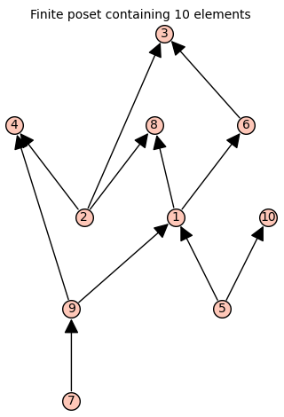

# Climber and diver metrics for posets

This file provides a set of SageMath functions for computing the climber and diver distances between elments in finite posets as well as the calculation of the shortest path in this context. These metrics are introduced in the article

> Olave A. A. "A new family of distances over partially ordered sets".

## Usage

To load the functions to your SageMath session, ensure that you are working in the same directory as the file `functions.sage`, and then run

```sage
load('functions.sage')
```
Take `P` to be a poset from the class `sage.combinat.posets.posets.FinitePoset` 
```sage
sage: # Create a random set of 10 elements
sage: set_random_seed(1)  # Results are reproducible
sage: P = posets.RandomPoset(10, 0.3)
sage: P
```
 

For now on, the order of the elements of `P` is given by the linear extension `P.list`
```sage
sage: P.list()
[7, 9, 5, 10, 2, 4, 1, 6, 3, 8]
```

### Distance between elements
Use the function `k_distance` to calculate the (symmetric) distance matrix from the family of climber and diver metrics for any subset of `P`.  

```sage
sage: #1-climber distance between the elements 7,2,3, and 10 in P
sage: P.k_distance(elements = [7,2,3,10])
[0 2 3 3]
[2 0 1 3]
[3 1 0 4]
[3 3 4 0]
```

```sage
sage: #fence-climber(infty-climber) distance between all elements of P
sage: P.k_distance(k=NaN)
[0 1 1 2 1 1 1 1 1 1]
[1 0 1 2 1 1 1 1 1 1]
[1 1 0 1 1 2 1 1 1 1]
[2 2 1 0 2 3 2 2 2 2]
[1 1 1 2 0 1 1 1 1 1]
[1 1 2 3 1 0 2 2 2 2]
[1 1 1 2 1 2 0 1 1 1]
[1 1 1 2 1 2 1 0 1 2]
[1 1 1 2 1 2 1 1 0 2]
[1 1 1 2 1 2 1 2 2 0]
```

```sage
#2-diver distance between the elements 7,4,1,6 and 3 in P 
P.k_distance(elements = [7,4,1,6,3], k=2,method='diver')
[0 1 1 2 2]
[1 0 1 1 1]
[1 1 0 1 1]
[2 1 1 0 1]
[2 1 1 1 0]
```
### Length of a path
Given a path gamma in `P` the function `k_length` calculates the length of gamma associatated to any climber or diver metric. The input of the function are the maximal chains of gamma listed in increasing order.
Take gamma to be the path {7,9,4,2,3}. Thus

```sage
sage: gamma = [[7,9,4],[2,4],[2,3]]
```

```sage
sage: # 1-climber length of gamma
sage: P.k_length(gamma)
3
```
```sage
sage: # fence-climber length of gamma
sage: P.k_length(gamma,k=NaN)
2
```
```sage
sage: # 2-diver length of gamma
sage: P.k_length(gamma,k=2, method= 'diver')
2
```

### A shortest path between elements 
Given two elements `x` and `y` in  `P`, the function `k_shortest_path` finds a path from `x` to `y` with minimal length associated to any climber or diver metric.

```sage
sage: x = 7
sage: y = 3
```

```sage
sage: # 1-climber shortest path between 7 and 3
sage: P.k_shortest_path(x,y)
[7, 9, 4, 2, 3]
```
```sage
sage: # fence-climber shortest path between 7 and 3
sage: P.k_shortest_path(x,y, k=NaN )
[7, 9, 1, 6, 3]
```
```sage
sage: # 2-diver shortest path between 7 and 3
sage: P.k_shortest_path(x,y, k=2, method= 'diver') 
[7, 9, 4, 2, 3]
```


                              


